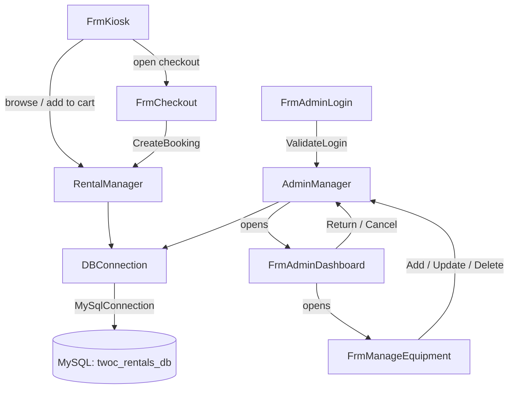

<div align="center">

<h1>2C Rentals &mdash; Equipment Rental System</h1>

<em>A self-service kiosk and admin portal for small equipment rental businesses, built with VB.NET and Windows Forms.</em>

[](https://dotnet.microsoft.com/)
[](https://dotnet.microsoft.com/)
[](https://www.mysql.com/)
[](https://www.microsoft.com/windows)

<br/>

[](https://dotnet.microsoft.com/)
[](https://learn.microsoft.com/en-us/dotnet/desktop/winforms/)
[](https://www.mysql.com/)

</div>

---

## Overview

**2C Rentals** is a Windows desktop application built for a small equipment rental business. It provides a touch-friendly self-service kiosk where customers can browse available gear, build a cart, and complete a rental booking -- all without staff involvement. A separate, password-protected admin portal lets staff manage the equipment catalog, monitor active and overdue rentals, and process returns or cancellations with automatic stock restoration.

**Core features:**

- **Self-service kiosk** -- customers browse equipment cards by category, adjust quantities, set rental days, and check out independently
- **Atomic bookings** -- a single MySQL transaction inserts the customer, rental header, and all line items, then decrements stock with an oversell guard
- **Auto-generated booking codes** -- unique `BK-YYYYMMDD-NNNN` identifiers assigned per booking
- **Admin dashboard** -- live stats cards (Active, Overdue, Today's Bookings), filterable rentals grid, and one-click Return/Cancel with stock restoration
- **Equipment CRUD** -- add, edit, and soft-delete equipment items from the admin portal without orphaning historical rental records
- **Secure authentication** -- admin passwords are stored and compared as SHA-256 hashes; plaintext is never persisted

---

## Tech Stack

| Technology                                | Version                  | Category  | Purpose                                           |
| ----------------------------------------- | ------------------------ | --------- | ------------------------------------------------- |
| VB.NET                                    | --                       | Language  | Application language                              |
| .NET                                      | 10.0 (`net10.0-windows`) | Framework | Runtime and SDK                                   |
| Windows Forms                             | built-in                 | UI        | Desktop GUI layer                                 |
| MySQL                                     | 8.0+                     | Database  | Persistent data store -- schema `twoc_rentals_db` |
| MySql.Data                                | 9.6.0                    | DB Driver | ADO.NET connector for MySQL                       |
| System.Configuration.ConfigurationManager | 9.0.4                    | Config    | Reads connection string from `App.config`         |
| System.Security.Cryptography              | built-in                 | Security  | SHA-256 password hashing                          |

---

## File & Directory Structure

```
Equipment-Rental-System/
+-- ERS.slnx                          # Visual Studio solution file
\-- ERS/
    +-- App.config                     # Connection string (key: TwoCRentals)
    +-- ERS.vbproj                     # SDK-style project -- framework & NuGet refs
    +-- setup_database.sql             # Full schema creation + seed data
    |
    +-- [Data Models]
    +-- EquipmentItem.vb               # POCO: equipment fields + IsAvailable property
    +-- CartItem.vb                    # POCO: holds EquipmentItem ref, qty, LineTotal()
    |
    +-- [Business / Service Layer]
    +-- DBConnection.vb                # Factory: returns MySqlConnection from App.config
    +-- HashHelper.vb                  # Utility: SHA-256 hex-string computation
    +-- RentalManager.vb               # Customer ops: load catalog, CreateBooking()
    +-- AdminManager.vb                # Admin ops: auth, stats, rental CRUD, equipment CRUD
    |
    +-- [Customer-Facing Forms]
    +-- FrmKiosk.vb                    # Equipment browser, cart sidebar, rental-days stepper
    +-- FrmKiosk.Designer.vb           # Designer-managed static controls
    +-- FrmCheckout.vb                 # Customer name/contact + rental date pickers
    +-- FrmConfirmation.vb             # Booking confirmed screen (displays booking code)
    |
    +-- [Admin Forms]
    +-- FrmAdminLogin.vb               # Username + password entry (SHA-256 verified)
    +-- FrmAdminDashboard.vb           # Stats cards + rentals grid + return/cancel actions
    +-- FrmManageEquipment.vb          # Equipment CRUD (name, category, rate, stock, icon)
    |
    \-- My Project/
        \-- Application.myapp          # WinForms startup configuration
```

**Key directories and why the project is structured this way:**

- **Business/Service layer** (`DBConnection`, `RentalManager`, `AdminManager`, `HashHelper`) -- all SQL lives here, keeping form code completely free of database logic and making queries easy to locate and test in isolation.
- **Data models** (`EquipmentItem`, `CartItem`) -- plain VB classes (POCOs) with no dependencies, passed between layers as typed containers.
- **Customer forms** (`FrmKiosk` -> `FrmCheckout` -> `FrmConfirmation`) -- a linear wizard flow; each form is opened as a dialog by the previous one, keeping navigation state simple.
- **Admin forms** (`FrmAdminLogin` -> `FrmAdminDashboard` -> `FrmManageEquipment`) -- separate flow launched from the kiosk via F12, keeping staff and customer surfaces cleanly isolated.

---

## Architecture & How the Code Works Together

The project uses a **layered desktop architecture**: UI forms call into static service classes, which use a single database-connection factory to execute parameterized SQL against MySQL.

### End-to-end request flow

**Customer booking:**

> User browses equipment on `FrmKiosk` -> selects items and quantities -> adjusts rental days -> clicks **Checkout** -> `FrmCheckout` collects name, contact, and dates -> calls `RentalManager.CreateBooking()` -> single MySQL transaction inserts customer, rental header, line items, and decrements stock -> `FrmConfirmation` displays the booking code.

**Admin operation:**

> Staff presses **F12** on the kiosk -> `FrmAdminLogin` hashes the submitted password and queries `admins` table -> on success, `FrmAdminDashboard` opens, calls `AdminManager.UpdateOverdueRentals()` and `AdminManager.GetStats()` -> staff selects a rental and clicks **Return** or **Cancel** -> `AdminManager.ReturnRental()` / `CancelRental()` restores stock and updates status in a single transaction.

### Layer communication



### Key design decisions

| Mechanism                  | Detail                                                                                                                                                                                                                                                         |
| -------------------------- | -------------------------------------------------------------------------------------------------------------------------------------------------------------------------------------------------------------------------------------------------------------- |
| **Atomic booking**         | `RentalManager.CreateBooking()` wraps four INSERTs/UPDATEs in one transaction. The stock `UPDATE` uses `WHERE avail_stock >= @qty` -- if 0 rows are affected, an `InvalidOperationException` is raised and the transaction rolls back, preventing overselling. |
| **Booking codes**          | `BK-YYYYMMDD-NNNN` -- the sequential suffix is derived by counting same-day bookings already in the database (e.g., `BK-20260416-0003`).                                                                                                                       |
| **Admin auth**             | `AdminManager.ValidateLogin()` calls `HashHelper.ComputeSHA256()` before the SELECT; no plaintext passwords are ever stored or compared.                                                                                                                       |
| **Overdue detection**      | `AdminManager.UpdateOverdueRentals()` runs `UPDATE rentals SET status='Overdue' WHERE rental_end < CURDATE() AND status='Active'` on every dashboard open -- accurate without a scheduled job.                                                                 |
| **Soft delete**            | `AdminManager.DeleteEquipment()` sets `is_active = 0`, preserving `rental_details` FK integrity for historical bookings. The kiosk query filters `WHERE is_active = 1`.                                                                                        |
| **Runtime UI in FrmKiosk** | Category filter pills (`AddFilterPills()`) and equipment cards (`RenderGrid()`) are built entirely at runtime; they are not visible in the Visual Studio Forms Designer -- this is intentional.                                                                |

---

## Getting Started

### Prerequisites

- **[.NET SDK](https://dotnet.microsoft.com/download)** >= 10.0
- **[MySQL Server](https://dev.mysql.com/downloads/mysql/)** >= 8.0
- **Windows OS** -- WinForms targets `net10.0-windows` and runs on Windows only

### Installation

**1. Clone the repository**

```bash
git clone https://github.com/Tways-study/Equipment-Rental-System.git
cd Equipment-Rental-System
```

**2. Create the database**

The script creates the `twoc_rentals_db` database, all five tables, six sample equipment items, and a default admin account.

```bash
mysql -u YOUR_MYSQL_USER -p < ERS/setup_database.sql
```

**3. Configure the connection string**

Open `ERS/App.config` and replace the credentials with your own:

```xml
<connectionStrings>
  <add name="TwoCRentals"
       connectionString="Server=localhost;Database=twoc_rentals_db;Uid=YOUR_USER;Pwd=YOUR_PASSWORD;CharSet=utf8mb4;"
       providerName="MySql.Data.MySqlClient" />
</connectionStrings>
```

> `CharSet=utf8mb4` is required -- equipment icon tags are stored as emoji.

**4. Restore NuGet packages**

```bash
dotnet restore
```

Fetches `MySql.Data` (v9.6.0) and `System.Configuration.ConfigurationManager` (v9.0.4).

### Environment / Configuration

`App.config` is the only configuration file. It must **never** be committed with real credentials.

| Key        | Description    | Required | Where to obtain                               |
| ---------- | -------------- | -------- | --------------------------------------------- |
| `Server`   | MySQL hostname | Yes      | Your MySQL server address (e.g., `localhost`) |
| `Database` | Schema name    | Yes      | Fixed: `twoc_rentals_db`                      |
| `Uid`      | MySQL username | Yes      | Your MySQL user account                       |
| `Pwd`      | MySQL password | Yes      | Your MySQL user password                      |
| `CharSet`  | Character set  | Yes      | Must be `utf8mb4` for emoji support           |

### Running the Project

**Development**

```bash
dotnet run --project ERS/ERS.vbproj
```

`FrmKiosk` opens as the startup form. Press **F12** anywhere on the kiosk to open the admin login dialog.

**Production -- self-contained publish**

Produces a folder deployable to any Windows machine without a pre-installed .NET runtime:

```bash
dotnet publish ERS/ERS.vbproj -c Release -r win-x64 --self-contained true
```

Output: `ERS/bin/Release/net10.0-windows/win-x64/publish/ERS.exe`

---

## Database Schema

```
customers
  customer_id (PK) | full_name | contact_no | created_at

equipment
  equipment_id (PK) | name | category | daily_rate
  total_stock | avail_stock | icon_tag | is_active

rentals
  rental_id (PK) | booking_code (UNIQUE) | customer_id (FK)
  rental_start | rental_end | security_dep | subtotal
  total_amount | status | created_at

rental_details
  detail_id (PK) | rental_id (FK) | equipment_id (FK)
  quantity | daily_rate | days_rented | line_total

admins
  admin_id (PK) | username (UNIQUE) | password_hash | full_name
```

Rental `status` lifecycle: `Active` -> `Overdue` (auto-flagged) -> `Returned` or `Cancelled`.

---

## Default Admin Credentials

| Field    | Value                                                             |
| -------- | ----------------------------------------------------------------- |
| Username | `admin`                                                           |
| Password | _(see `setup_database.sql` -- **change this after first login**)_ |

To add additional admin accounts:

```sql
INSERT INTO admins (username, password_hash, full_name)
VALUES ('newuser', SHA2('your_chosen_password', 256), 'Full Name');
```

---

## Troubleshooting

| Symptom                                         | Fix                                                                                        |
| ----------------------------------------------- | ------------------------------------------------------------------------------------------ |
| Build error `MSB3027` / `MSB3021` (file locked) | Close any running `ERS.exe` instance before rebuilding.                                    |
| Equipment icons show as `?` boxes               | Ensure `CharSet=utf8mb4` is in the connection string and MySQL uses a `utf8mb4` collation. |
| `MySqlException: Access denied` on launch       | Verify `Uid` and `Pwd` in `App.config` match your MySQL user.                              |
| `Unknown database 'twoc_rentals_db'`            | Re-run `setup_database.sql` against the correct MySQL server instance.                     |
| Dynamic cards/pills not visible in designer     | These controls are built in code at runtime -- run the project to see them.                |

---

## Contributing

1. Fork the repository.
2. Create a feature branch: `git checkout -b feature/your-feature-name`
3. Commit your changes with a descriptive message: `git commit -m "Add: brief description"`
4. Push to your fork: `git push origin feature/your-feature-name`
5. Open a Pull Request against the `main` branch describing what was changed and why.

---

## License

No license file detected. All rights reserved.
